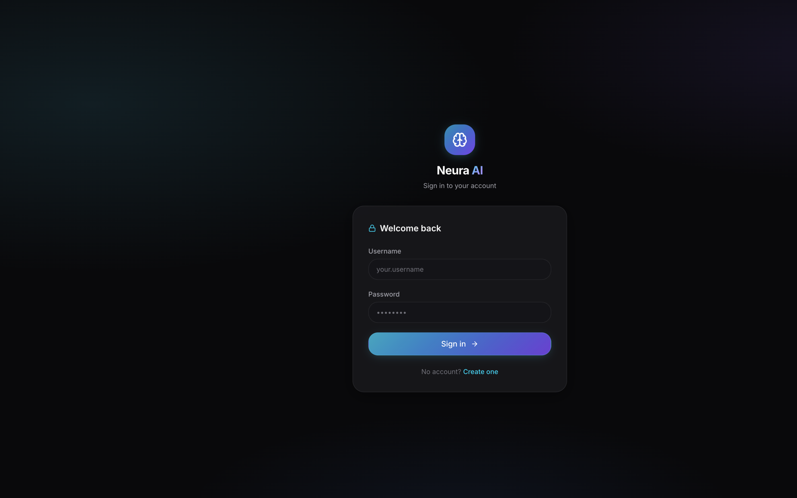
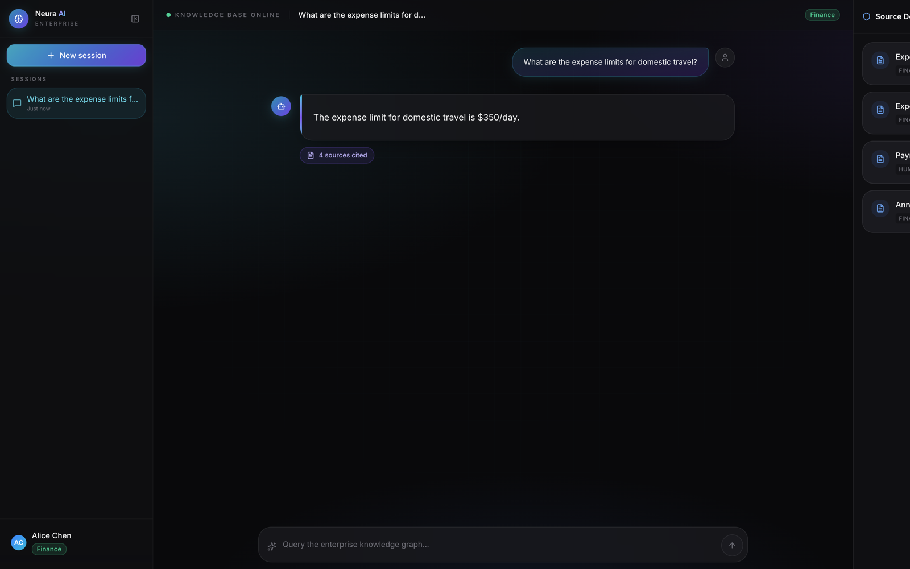
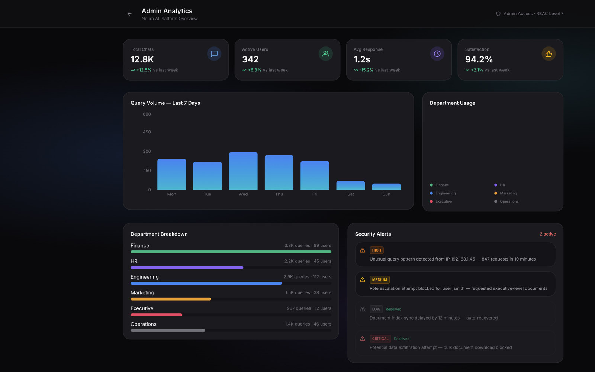

# Neura AI

Role-based enterprise RAG assistant. Ask about internal policies, budgets, and compliance — answers are retrieved only from documents your department is allowed to see.

**Live demo:** [carloskipkoech.github.io/neura-ai](https://carloskipkoech.github.io/neura-ai/)

## Screenshots

**Sign in**



**Role-scoped chat with source citations**



**Admin analytics**



## Features

- Sign up with a department role; login loads the role from the account
- RAG chat over a synthetic enterprise knowledge base (24 PDFs)
- RBAC so Finance, HR, Engineering, and other roles see different documents
- Source citations next to each answer
- Admin analytics dashboard
- JWT auth (FastAPI) + React UI

## Demo accounts

| Username | Password | Role |
|----------|----------|------|
| `alice.chen` | `demo12345` | finance |
| `bob.martinez` | `demo12345` | hr |
| `carol.williams` | `demo12345` | marketing |
| `david.kim` | `demo12345` | engineering |
| `elena.rodriguez` | `demo12345` | executive |
| `frank.johnson` | `demo12345` | employee |
| `admin` | `admin12345` | admin |

## Tech stack

- **Frontend:** React, TypeScript, Vite, Tailwind CSS, Framer Motion
- **Backend:** FastAPI, Qdrant, LangChain, Gemini embeddings + chat
- **Auth:** JWT, SQLite, role-based access control

## Local development

```bash
# Backend
cd backend
python3 -m venv .venv
source .venv/bin/activate
pip install -r requirements.txt
# add GOOGLE_API_KEY to backend/.env
uvicorn app:app --reload --port 8000

# Frontend
cd frontend
npm install
echo 'VITE_API_URL=http://127.0.0.1:8000' > .env.local
npm run dev
```

UI: [http://localhost:5174](http://localhost:5174)

## Deploy

Frontend is on GitHub Pages. API is on Fly at [neura-ai-api.fly.dev](https://neura-ai-api.fly.dev). See [DEPLOY.md](DEPLOY.md) for env vars and deploy commands.
